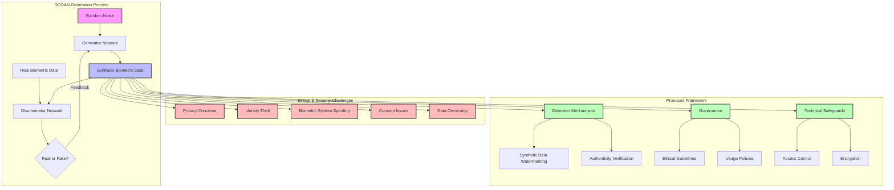

# MAHE Research DCGAN Project 🧠🖼️

This repository contains implementation of a Deep Convolutional Generative Adversarial Network (DCGAN) for generating synthetic images.

## 📋 Overview

DCGANs are a class of Convolutional Neural Networks where:
- A Generator network learns to create images that look real
- A Discriminator network learns to distinguish between real and fake images
- Both networks compete and improve through adversarial training

## 🛠️ Requirements

- Python 3.7+
- PyTorch
- torchvision
- numpy
- matplotlib
- tqdm

Install dependencies with:
```bash
pip install -r requirements.txt
```

## 🚀 How to Run

1. **Clone the repository**
   ```bash
   git clone <repository-url>
   cd MAHE-Research-DCGAN
   ```

2. **Prepare your dataset**
   - Place your images in the `data/` directory, or
   - Modify the data loading code to use your custom dataset

3. **Train the model**
   ```bash
   python train.py --epochs 100 --batch_size 64 --lr 0.0002
   ```

4. **Generate images**
   ```bash
   python generate.py --model_path checkpoints/generator.pth --num_images 10
   ```

## 🖼️ Sample Generated Images


*The above image shows a grid of synthetically generated fingerprint patterns created by our DCGAN model. The model has learned to reproduce realistic ridge patterns, loops, and whorls characteristic of human fingerprints while maintaining diversity across samples.*

## 📊 Model Architecture

### Generator
- Takes random noise vector as input
- Uses transposed convolutions to generate images
- Batch normalization and ReLU activations
- Outputs images with tanh activation

### Discriminator
- Convolutional network with stride=2
- Leaky ReLU activations
- Outputs probability of image being real

## 🔒 Ethical and Security Framework

Our research addresses the ethical and security challenges associated with generating synthetic biometric data using DCGANs. Below is a framework visualization:



This framework addresses how our DCGAN implementation for generating biometric data intersects with privacy, security, and ethical concerns, while proposing technical and governance solutions to mitigate potential risks.

## 📝 Citation

If you use this code for your research, please cite:

```
@misc{mahe-dcgan,
  author = {MAHE Research Team},
  title = {MAHE-Research-DCGAN},
  year = {2023},
  publisher = {GitHub},
  url = {https://github.com/username/MAHE-Research-DCGAN}
}
```

## 📜 License

This project is licensed under the MIT License - see the LICENSE file for details.

## 👥 Contributors

- MAHE Research Team

## 🙏 Acknowledgements

- [Original DCGAN Paper](https://arxiv.org/abs/1511.06434)
- [PyTorch DCGAN Tutorial](https://pytorch.org/tutorials/beginner/dcgan_faces_tutorial.html)
