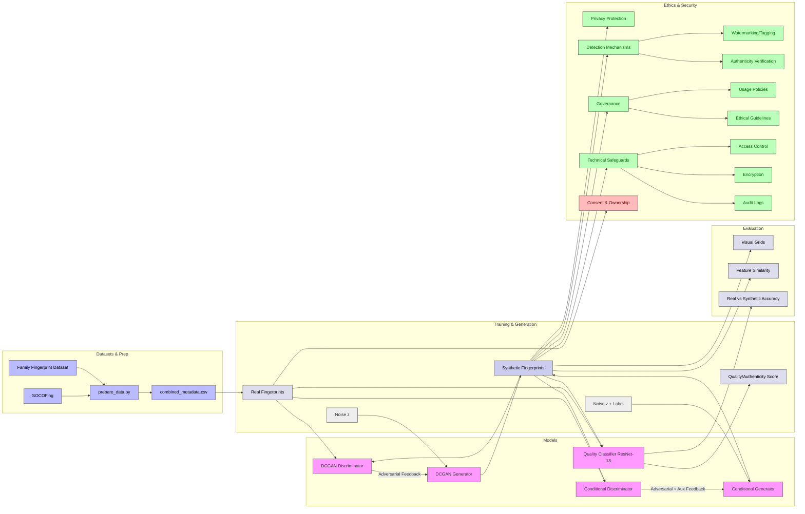

# FingerGAN: Synthetic Fingerprint Generation with GANs 🖼️👆

This repository contains implementation of Deep Convolutional Generative Adversarial Networks (DCGAN) and Conditional GANs (CGAN) for generating synthetic fingerprint images. The project focuses on biometric data augmentation while addressing privacy and security concerns.

## 📋 Overview

FingerGAN implements multiple GAN architectures for synthetic fingerprint generation:
- DCGAN: Standard Deep Convolutional GAN for unconditional fingerprint generation
- Conditional GAN: Label-conditioned generation based on fingerprint regions/characteristics
- Classification: Quality assessment using ResNet-based classifiers

The system uses two primary datasets:
- SOCOFing: Sokoto Coventry Fingerprint Dataset
- FAMILY_FINGERPRINT_DATASET: Family-based fingerprint collection

## 🛠️ Requirements

- Python 3.7+
- PyTorch
- torchvision
- pandas
- PIL (Pillow)
- streamlit
- tqdm
- matplotlib
- numpy

Install dependencies with:
```bash
pip install -r requirements.txt
```

## 🗂️ Project Structure

```
FingerGAN/
├── convert_image.py           # Image conversion utilities
├── data/                      # Dataset directory
│   ├── combined_metadata.csv  # Unified dataset metadata
│   ├── SOCOFing/              # SOCOFing dataset
│   └── FAMILY_FINGERPRINT_DATASET/  # Family fingerprint dataset
├── models/                    # GAN model architectures
│   ├── cond_generator.py      # Conditional generator
│   ├── cond_discriminator.py  # Conditional discriminator
│   ├── generator.pth          # Trained generator weights
│   └── discriminator.pth      # Trained discriminator weights
├── scripts/                   # Training and utility scripts
│   ├── train_dcgan.py         # Train standard DCGAN
│   ├── train_cgan.py          # Train conditional GAN
│   ├── train_classifier.py    # Train quality classifier
│   ├── prepare_data.py        # Data preprocessing
│   ├── generate_samples.py    # Generate synthetic samples
│   ├── eval_metrics.py        # Evaluation metrics
│   └── app.py                 # Streamlit web interface
├── outputs/                   # Training outputs
│   ├── checkpoints/           # Model checkpoints
│   ├── logs/                  # Training logs
│   └── samples/               # Generated samples during training
└── generated_images/          # Final generated outputs
    └── generated_fingerprints.png
```

## 🚀 How to Run

### 1. Data Preparation
```bash
cd FingerGAN/scripts
python prepare_data.py
```
This creates data/combined_metadata.csv combining both datasets.

### 2. Train DCGAN
```bash
python train_dcgan.py --epochs 100 --batch_size 64 --lr 0.0002
```

### 3. Train Conditional GAN
```bash
python train_cgan.py --epochs 50 --batch_size 64 --n_labels 2 --img_size 64
```

### 4. Train Quality Classifier
```bash
python train_classifier.py
```

### 5. Generate Samples
```bash
python generate_samples.py --model_path ../models/generator.pth --num_images 16
```

### 6. Launch Web Interface
```bash
streamlit run app.py
```

## 🖼️ Sample Generated Images


*Synthetically generated fingerprint patterns showing realistic ridge structures, minutiae points, and natural variations.*

## 📊 Model Architecture

### DCGAN Generator
- Latent dimension: 100
- Architecture: Transposed convolutions with batch normalization
- Output: 64x64 grayscale fingerprint images

### Conditional GAN
- Generator: Takes noise vector + label (region/type)
- Discriminator: Auxiliary classifier for label prediction
- Labels: Fingerprint regions (e.g., Africa, SouthAsia)

### Quality Classifier
- Architecture: ResNet-18 backbone
- Purpose: Distinguish real vs synthetic fingerprints
- Input: 128x128 RGB images (converted from grayscale)

## 📈 Training Features

- Progress Tracking: TQDM progress bars with loss monitoring
- Checkpointing: Automatic model saving during training
- Sample Generation: Periodic sample generation for monitoring
- Multi-GPU Support: CUDA acceleration when available

## 🔍 Dataset Information

### SOCOFing Dataset
- Format: BMP images
- Naming: 001__M_Left_index_finger.BMP
- Features: Subject ID, gender, finger type
- Region: Africa

### Family Fingerprint Dataset
- Structure: Family-based organization
- Features: Family relationships, multiple members
- Region: SouthAsia
- Format: Hierarchical directory structure

## 🎯 Key Features

1. Conditional Generation: Generate fingerprints based on demographic labels
2. Quality Assessment: Automated evaluation of generated samples
3. Web Interface: Interactive Streamlit dashboard
4. Multi-Dataset Support: Unified handling of different fingerprint datasets
5. Flexible Training: Configurable hyperparameters and architectures

## 📊 Evaluation Metrics

The project includes evaluation scripts for:
- Visual Quality Assessment: Human-interpretable sample grids
- Classification Accuracy: Real vs synthetic discrimination
- Feature Similarity: Statistical comparison of ridge patterns

## 🔒 Ethical and Security Framework

This framework addresses privacy, security, and ethical concerns in biometric data generation:


```mermaid
graph LR
    %% Datasets & Preparation
    subgraph "Datasets & Prep"
        DSO[SOCOFing] --> PREP[prepare_data.py]
        DFAM[Family Fingerprint Dataset] --> PREP
        PREP --> META[combined_metadata.csv]
    end

    %% Models
    subgraph "Models"
        GDC[DCGAN Generator]
        DDC[DCGAN Discriminator]
        GCG[Conditional Generator]
        DCG[Conditional Discriminator]
        CLS["Quality Classifier ResNet-18"]
    end

    %% Training & Generation
    subgraph "Training & Generation"
        Z[Noise z] --> GDC
        ZL[Noise z + Label] --> GCG
        GDC --> SYN[Synthetic Fingerprints]
        GCG --> SYN
        REAL[Real Fingerprints] --> DDC
        REAL --> DCG
        SYN --> DDC
        SYN --> DCG
        DDC --> |Adversarial Feedback| GDC
        DCG --> |Adversarial + Aux Feedback| GCG
        REAL --> CLS
        SYN --> CLS
        CLS --> QUAL[Quality/Authenticity Score]
    end

    %% Evaluation
    subgraph "Evaluation"
        SYN --> E1[Visual Grids]
        SYN --> E2[Feature Similarity]
        CLS --> E3[Real vs Synthetic Accuracy]
    end

    %% Ethics & Security
    subgraph "Ethics & Security"
        SYN --> PRIV[Privacy Protection]
        SYN --> DET[Detection Mechanisms]
        DET --> WM[Watermarking/Tagging]
        DET --> AV[Authenticity Verification]
        GOV[Governance] --> POL[Usage Policies]
        GOV --> EG[Ethical Guidelines]
        SAFE[Technical Safeguards] --> AC[Access Control]
        SAFE --> ENC[Encryption]
        SAFE --> LOG[Audit Logs]
        CONS[Consent & Ownership]
    end

    %% Cross-links
    META --> REAL
    SYN --> GOV
    SYN --> SAFE
    REAL --> CONS

    %% Styles
    style DSO fill:#bbf,stroke:#333,color:#000
    style DFAM fill:#bbf,stroke:#333,color:#000
    style PREP fill:#bbf,stroke:#333,color:#000
    style META fill:#bbf,stroke:#333,color:#000

    style GDC fill:#f9f,stroke:#333,color:#333
    style DDC fill:#f9f,stroke:#333,color:#333
    style GCG fill:#f9f,stroke:#333,color:#333
    style DCG fill:#f9f,stroke:#333,color:#333
    style CLS fill:#f9f,stroke:#333,color:#333

    style Z fill:#eee,stroke:#333,color:#333
    style ZL fill:#eee,stroke:#333,color:#333
    style REAL fill:#dde,stroke:#333,color:#000
    style SYN fill:#cce,stroke:#333,color:#000
    style QUAL fill:#dde,stroke:#333,color:#000

    style E1 fill:#dde,stroke:#333,color:#000
    style E2 fill:#dde,stroke:#333,color:#000
    style E3 fill:#dde,stroke:#333,color:#000

    style PRIV fill:#bfb,stroke:#333,color:#060
    style DET fill:#bfb,stroke:#333,color:#060
    style WM fill:#bfb,stroke:#333,color:#060
    style AV fill:#bfb,stroke:#333,color:#060
    style GOV fill:#bfb,stroke:#333,color:#060
    style POL fill:#bfb,stroke:#333,color:#060
    style EG fill:#bfb,stroke:#333,color:#060
    style SAFE fill:#bfb,stroke:#333,color:#060
    style AC fill:#bfb,stroke:#333,color:#060
    style ENC fill:#bfb,stroke:#333,color:#060
    style LOG fill:#bfb,stroke:#333,color:#060
    style CONS fill:#fbb,stroke:#333,color:#600
```

- Privacy Protection: Synthetic data reduces reliance on real biometric collection and avoids reproducing individual identities.
- Security: Classifiers and safeguards help detect misuse; model access is controlled and auditable.
- Research Ethics: Clear documentation of synthetic nature and compliance with biometric regulations.

## 🔧 Configuration

### Training Parameters
```python
# DCGAN Training
epochs = 100
batch_size = 64
learning_rate = 0.0002
latent_dim = 100
image_size = 64

# Conditional GAN
n_labels = 2  # Number of region labels
aux_loss_weight = 1.0  # Auxiliary classifier loss weight
```

### Model Configuration
```python
# Generator: 100 -> 64x64
# Discriminator: 64x64 -> 1 + labels
# Classifier: 128x128 -> 2 classes (real/synthetic)
```

## 📝 Citation

```bibtex
@misc{fingergan,
  title={FingerGAN: Synthetic Fingerprint Generation using Generative Adversarial Networks},
  author={MAHE Research Team},
  year={2024},
  url={https://github.com/username/MAHE-Research-DCGAN}
}
```

## 📜 License

This project is licensed under the MIT License - see the LICENSE file for details.

## 👥 Contributors

- MAHE Research Team
- Vaibhav (Project Lead)

## 🙏 Acknowledgements

- DCGAN Paper - Radford et al. (https://arxiv.org/abs/1511.06434)
- SOCOFing Dataset - Sokoto Coventry Fingerprint Dataset (http://www.kaggle.com/datasets/ruizgara/socofing)
- PyTorch Team for the deep learning framework
- Streamlit for the web interface framework

## 🚧 Future Work

- [ ] Implement FID and IS metrics for quantitative evaluation
- [ ] Add support for higher resolution generation (128x128, 256x256)
- [ ] Integrate StyleGAN architecture for improved quality
- [ ] Develop fingerprint minutiae extraction and comparison
- [ ] Add support for additional demographic conditions
